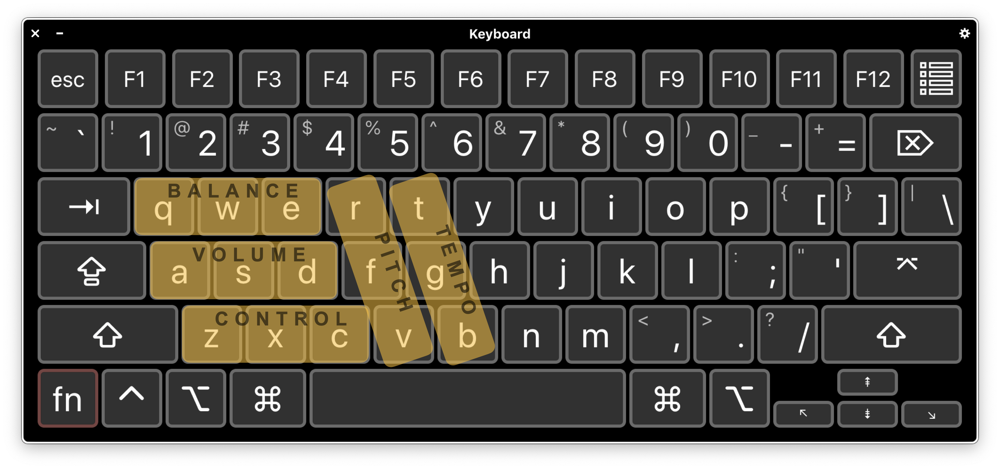

# kplay

[English](https://gitee.com/wksuper/kplay/blob/master/README.md) | [简体中文](https://gitee.com/wksuper/kplay/blob/master/README-cn.md)

## 介绍

kplay是一个纯控制台的可以实时调音的wav文件播放器。

主要功能：

- 音量调节
- 左右声道平衡调节
- 音调调节
- 节拍调节
- 循环播放
- 输出保存成文件
- 支持无交互模式运行（适用于命令行批处理）
- 跨平台（在GNU-Linux和MacOS上工作得很好)

## 依赖

1. kplay是一个基于百灵鸟的应用，依赖于 ***百灵鸟*** 库。先访问<https://gitee.com/wksuper/lark-release>以安装之。
2. kplay运行时依赖于 ***SoundTouch*** 库。

```bash
$ sudo apt-get install libsoundtouch-dev
```

3. 若使用`-o portaudio`（默认）选项运行kplay，则需要安装 ***portaudio*** 库。

```bash
$ sudo apt-get install libportaudio2
```

4. 若使用`-o alsa`选项运行kplay，则需要安装 ***alsa-lib*** 库。

```bash
$ sudo apt-get install libasound2-dev
```

5. 若使用`-o tinyalsa`选项运行kplay，则需要安装 ***tinyalsa-lib*** 库。

```bash
$ sudo apt-get install libtinyalsa-dev
```

## 编译和安装

```bash
cd kplay
mkdir build && cd build
cmake -DCMAKE_BUILD_TYPE=Release ..
cmake --build .
cmake --install .
```

## 运行时截图


## 功能键


