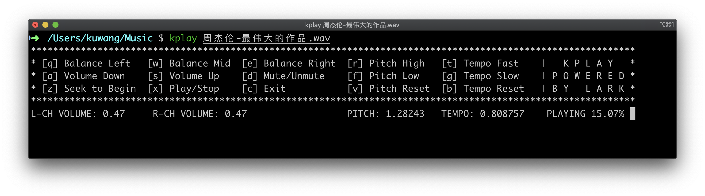

# kplay

[English](https://gitee.com/wksuper/kplay/blob/master/README.md) | [简体中文](https://gitee.com/wksuper/kplay/blob/master/README-cn.md)

## Introduction

kplay is a pure console wav file player that can tune the sound in real-time.

Main features

- Volume adjustment
- Left right channel balance adjustment
- Pitch adjustment
- Tempo adjustment
- Saving output to file
- Cross platform (Works well on GNU-Linux and MacOS)

## Dependency

1. kplay is a lark-based application depending on the ***lark*** library. Visit <https://gitee.com/wksuper/lark-release> to get it installed first.
2. The ***SoundTouch*** library is needed by kplay at runtime.

```bash
$ sudo apt-get install libsoundtouch-dev
```

3. If the option `-o portaudio` (default) is given to run kplay, then the ***portaudio*** library is needed.

```bash
$ sudo apt-get install libportaudio2
```

4. If the option `-o alsa` is given to run kplay, then the ***alsa-lib*** library is needed.

```bash
$ sudo apt-get install libasound2-dev
```

5. If the option `-o tinyalsa` is given to run kplay, then the ***tinyalsa-lib*** library is needed.

```bash
$ sudo apt-get install libtinyalsa-dev
```

## Build and Install

```bash
$ cd kplay
$ mkdir build && cd build
$ cmake ..
$ make
$ sudo make install
$ sudo ldconfig
```

## Running Screenshot



## Function Keys


